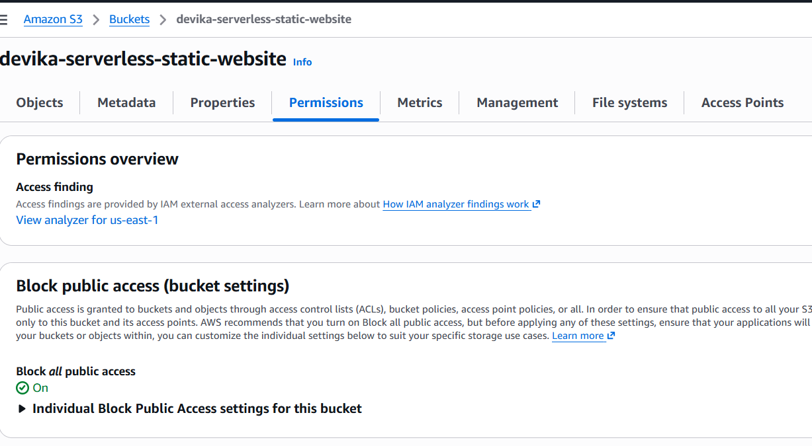
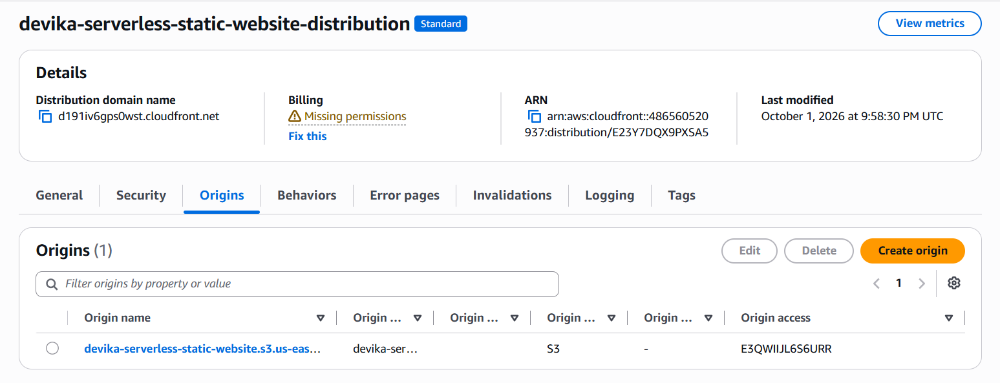
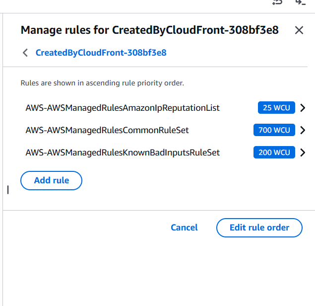
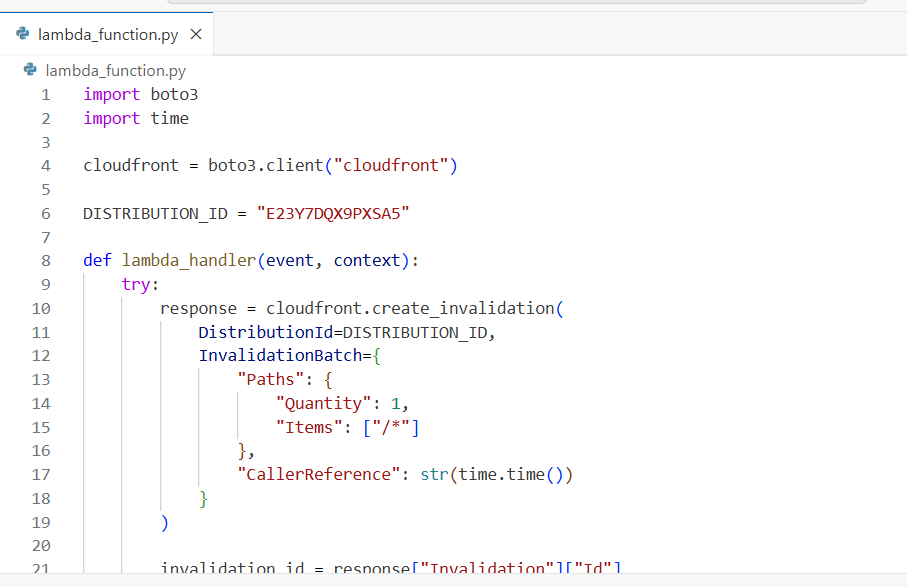
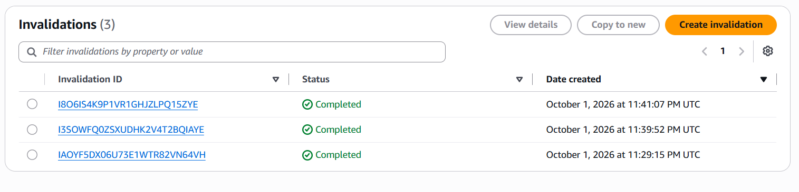
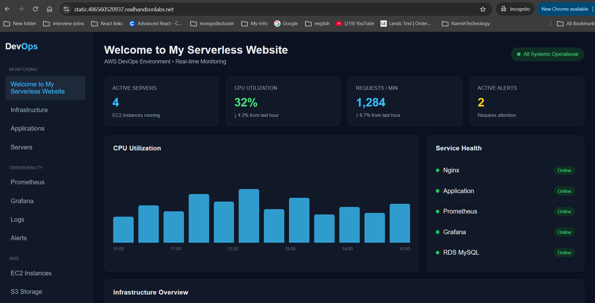

# AWS Serverless Static Website Architecture

A secure, highly available, and globally distributed static website architecture built using Amazon S3, Amazon CloudFront, Route 53, AWS Certificate Manager (ACM), AWS WAF, AWS Lambda, IAM, and CloudWatch.

The solution keeps the S3 origin private, serves content through CloudFront over HTTPS, protects incoming requests with AWS WAF, and automatically invalidates the CloudFront cache when website content is updated in S3.

---

## Architecture


### Request Flow

```text
User
  ↓
Route 53
  ↓
AWS WAF
  ↓
CloudFront + ACM
  ↓
Origin Access Control (OAC)
  ↓
Private Amazon S3
```

### Automated Content Update Flow

```text
S3 Object Update
      ↓
S3 Event Notification
      ↓
AWS Lambda
      ↓
CloudFront CreateInvalidation
      ↓
Updated Content Delivered
```

---

## AWS Services Used

| Service                 | Purpose                                         |
| ----------------------- | ----------------------------------------------- |
| Amazon S3               | Stores static website files                     |
| Amazon CloudFront       | Global CDN and content delivery                 |
| Origin Access Control   | Provides secure CloudFront access to private S3 |
| Route 53                | DNS and custom domain routing                   |
| AWS Certificate Manager | TLS certificate for HTTPS                       |
| AWS WAF                 | Application-layer request filtering             |
| AWS Lambda              | Automates CloudFront cache invalidation         |
| AWS IAM                 | Least-privilege Lambda permissions              |
| Amazon CloudWatch       | Lambda execution logging                        |

---

## Security Design

The architecture implements multiple security controls:

- S3 Block Public Access enabled
- Private S3 origin
- CloudFront Origin Access Control (OAC)
- HTTPS using ACM
- AWS WAF associated with CloudFront
- AWS Managed WAF rule groups
- Distribution-specific `cloudfront:CreateInvalidation` permission
- CloudWatch logging for Lambda execution

The S3 bucket is not directly exposed to internet users. Website traffic is delivered through CloudFront.

---

## AWS WAF Protection

The CloudFront distribution is protected using AWS WAF with the following AWS Managed Rule Groups:

- `AWSManagedRulesAmazonIpReputationList`
- `AWSManagedRulesCommonRuleSet`
- `AWSManagedRulesKnownBadInputsRuleSet`

These rules provide protection against common web attack patterns, known malicious inputs, and IP addresses associated with malicious activity.

> AWS WAF request logging was not enabled in this implementation.

Detailed WAF configuration is available in [`waf/README.md`](waf/README.md).

---

## Automated CloudFront Cache Invalidation

Website updates are automated using an event-driven workflow.

When an object is created or updated in the S3 bucket:

1. S3 generates an `ObjectCreated` event.
2. The S3 Event Notification invokes Lambda.
3. Lambda calls the CloudFront `CreateInvalidation` API.
4. CloudFront invalidates `/*`.
5. Updated website content is retrieved from the S3 origin.

This removes the need to manually create CloudFront invalidations after website updates.

---

## Lambda Configuration

The Lambda function uses Python and `boto3` to create CloudFront invalidations.

For repository portability, the CloudFront distribution ID is configured using:

```text
CLOUDFRONT_DISTRIBUTION_ID
```

as a Lambda environment variable.

The deployed lab implementation initially used the distribution ID directly in the function code; the repository version externalizes this configuration to make the function easier to reuse across environments.

---

## IAM Design

The Lambda execution role uses:

- `AWSLambdaBasicExecutionRole` for CloudWatch Logs
- A custom least-privilege policy allowing:

```text
cloudfront:CreateInvalidation
```

only against the required CloudFront distribution.

See:

[`iam/lambda-cloudfront-policy.json`](iam/lambda-cloudfront-policy.json)

---

## Implementation Phases

### Phase 1 — Storage

- Created S3 bucket
- Enabled S3 Versioning
- Enabled Block Public Access
- Uploaded static website content

### Phase 2 — Content Delivery

- Created CloudFront distribution
- Configured private S3 origin
- Configured Origin Access Control
- Updated S3 bucket policy
- Configured `index.html` as the default root object

### Phase 3 — HTTPS & DNS

- Requested ACM certificate in `us-east-1`
- Completed DNS validation through Route 53
- Associated certificate with CloudFront
- Configured custom domain
- Created Route 53 Alias record

### Phase 4 — Web Security

- Created AWS WAF Web ACL
- Associated WAF with CloudFront
- Configured AWS Managed Rule Groups

### Phase 5 — Event-Driven Automation

- Created Lambda execution role
- Implemented CloudFront invalidation function
- Configured S3 Event Notification
- Connected S3 directly to Lambda
- Automatically invalidated CloudFront after object updates

### Phase 6 — Validation

- Verified HTTPS website access
- Tested Lambda manually
- Verified CloudFront invalidation
- Updated website content in S3
- Verified automatic Lambda invocation
- Confirmed updated content through CloudFront

---

## Implementation Evidence

The repository contains **26 screenshots** documenting the implementation and validation process.

Examples:

### Private S3 Origin



### CloudFront Origin Access Control



### AWS WAF Managed Rules



### Lambda CloudFront Invalidation



### Automatic S3-Triggered Invalidation



### Final Website Validation



For the complete deployment sequence, see the:

**[Implementation Guide](docs/implementation-guide.md)**

---

## Repository Structure

```text
aws-serverless-static-website/
│
├── architecture/
│   └── architecture-diagram.png
│
├── docs/
│   └── implementation-guide.md
│
├── iam/
│   └── lambda-cloudfront-policy.json
│
├── lambda/
│   └── cloudfront_invalidation.py
│
├── screenshots/
│   ├── 01-s3-bucket.png
│   ├── ...
│   └── 26-website-updated-after-invalidation.png
│
├── waf/
│   └── README.md
│
├── website/
│   └── index.html
│
└── README.md
```

---

## Troubleshooting & Engineering Decisions

### Private S3 Access

Instead of making the S3 bucket publicly accessible, CloudFront Origin Access Control was used to securely retrieve objects from the private bucket.

### ACM Certificate Validation

The ACM certificate required DNS validation through Route 53 before it could be associated with the CloudFront distribution.

### CloudFront Cached Content

Website changes may not immediately appear because CloudFront can continue serving cached objects.

This was addressed by implementing automatic CloudFront invalidation using S3 Event Notifications and Lambda.

### Lambda Authorization

The Lambda function requires `cloudfront:CreateInvalidation`. The permission was restricted to the required CloudFront distribution instead of granting broad CloudFront permissions.

### EventBridge

EventBridge is not required for this implementation. S3 invokes Lambda directly using an S3 Event Notification.

---

## Future Enhancements

Potential production enhancements include:

- Infrastructure as Code using Terraform
- CI/CD deployment through GitHub Actions
- Separate development, staging, and production environments
- AWS WAF logging and centralized security monitoring
- CloudFront access logging
- S3 lifecycle policies
- CloudWatch alarms and operational dashboards
- Automated security and deployment validation

---

## Outcome

This project demonstrates a secure AWS static website architecture with:

**Private S3 + CloudFront + OAC + Route 53 + ACM + AWS WAF + Lambda + IAM + CloudWatch**

It also demonstrates an event-driven content deployment workflow where S3 updates automatically trigger CloudFront cache invalidation.
