# AWS Serverless Static Website — Implementation Guide

## Project Overview

This project deploys a secure serverless static website using Amazon S3, Amazon CloudFront, Route 53, AWS Certificate Manager (ACM), AWS WAF, AWS Lambda, IAM, and CloudWatch.

The S3 bucket remains private and is accessed through CloudFront using Origin Access Control (OAC). HTTPS is provided through ACM, AWS WAF protects the CloudFront distribution, and S3 object updates automatically trigger a Lambda function that creates a CloudFront cache invalidation.

---

## Architecture

### Website Request Flow

User → Route 53 → AWS WAF → CloudFront → OAC → Private S3

### Automatic Deployment Flow

Website Update → S3 ObjectCreated Event → Lambda → CloudFront Invalidation → Updated Content

---

# Phase 1 — S3 Static Website Storage

## Step 1 — Create the S3 Bucket

Created an Amazon S3 bucket to store the static website files.

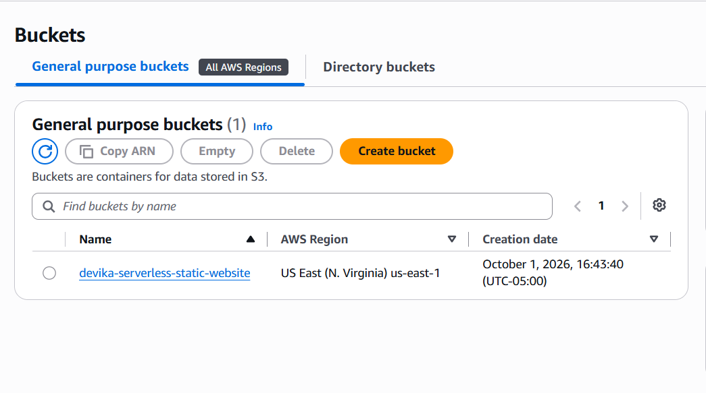

## Step 2 — Enable S3 Versioning

Enabled S3 Versioning to preserve previous versions of website objects.

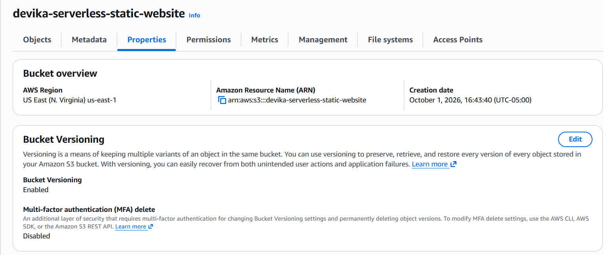

## Step 3 — Keep the S3 Bucket Private

Enabled S3 Block Public Access. The website content is not exposed directly through S3.

---

# Phase 2 — CloudFront and Secure Origin Access

## Step 4 — Configure Private S3 Access

Configured CloudFront to use the private S3 bucket as its origin.

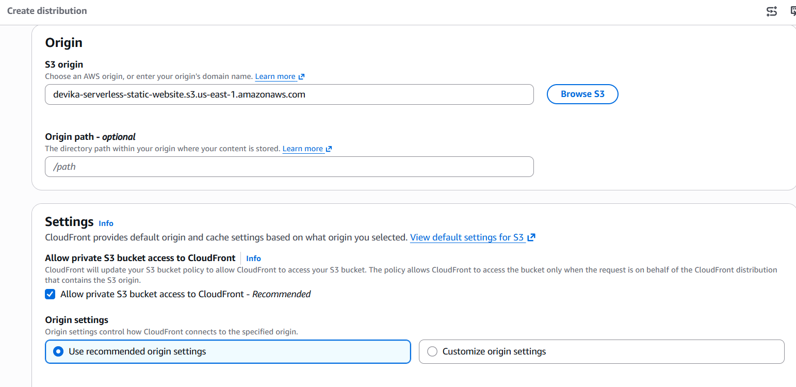

## Step 5 — Add AWS WAF Protection

Configured security protection for the CloudFront distribution using AWS WAF.

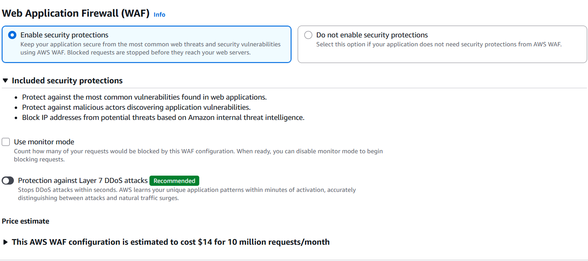

## Step 6 — Create the CloudFront Distribution

Created an Amazon CloudFront distribution to deliver the website globally.

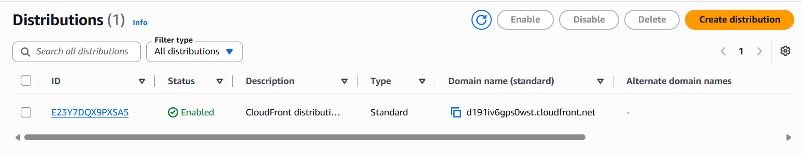

## Step 7 — Configure Origin Access Control

Configured CloudFront Origin Access Control (OAC) so CloudFront can securely access the private S3 bucket.

## Step 8 — Configure the S3 Bucket Policy

Updated the S3 bucket policy to allow access from the authorized CloudFront distribution.

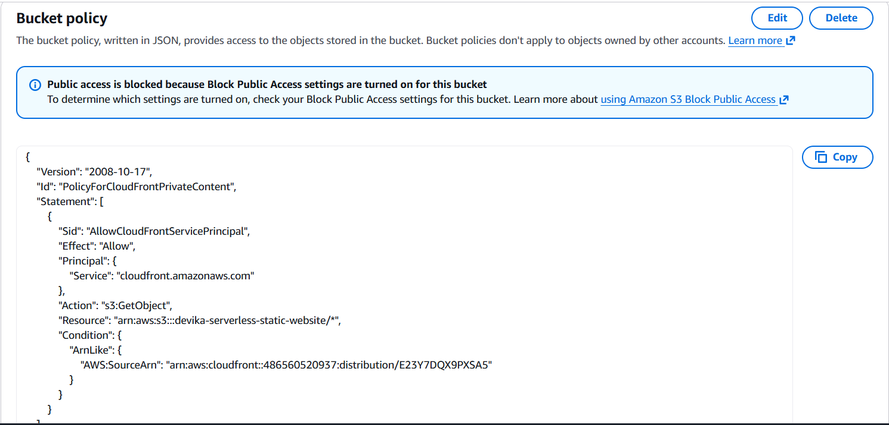

## Step 9 — Configure the Default Root Object

Configured `index.html` as the CloudFront default root object.

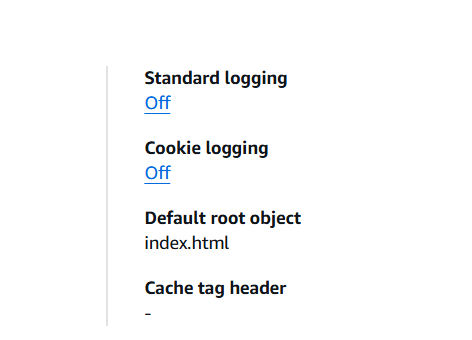

---

# Phase 3 — HTTPS and Custom Domain

## Step 10 — Request an ACM Certificate

Requested an SSL/TLS certificate using AWS Certificate Manager.

For CloudFront, the ACM certificate is provisioned in the `us-east-1` Region.

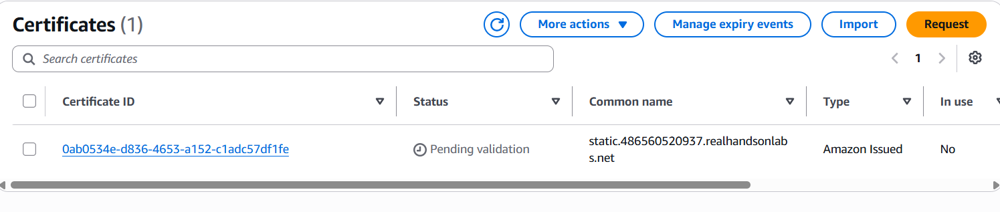

## Step 11 — Validate the Certificate with Route 53

Created the ACM DNS validation CNAME record in Route 53.

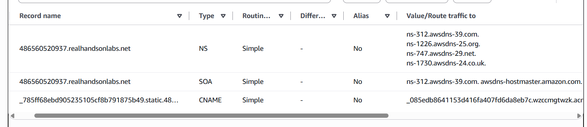

## Step 12 — Verify ACM Certificate

Confirmed that the ACM certificate was successfully issued.

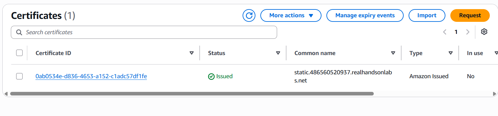

## Step 13 — Configure CloudFront HTTPS

Associated the custom domain and ACM certificate with the CloudFront distribution.

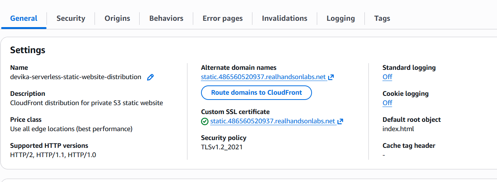

## Step 14 — Configure Route 53 Alias

Created a Route 53 Alias record pointing the custom domain to the CloudFront distribution.

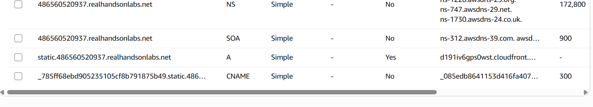

---

# Phase 4 — AWS WAF Security

## Step 15 — Create the WAF Web ACL

Created an AWS WAF Web ACL and associated it with the CloudFront distribution.

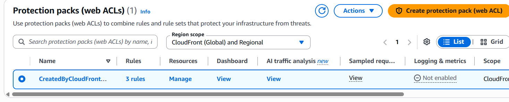

## Step 16 — Configure AWS Managed Rules

Configured AWS Managed Rule Groups:

- AWSManagedRulesAmazonIpReputationList
- AWSManagedRulesCommonRuleSet
- AWSManagedRulesKnownBadInputsRuleSet

WAF request logging was not enabled in this implementation.

---

# Phase 5 — Validate HTTPS Website Access

## Step 17 — Test the Website

Verified that the website was successfully accessible through the custom domain over HTTPS.

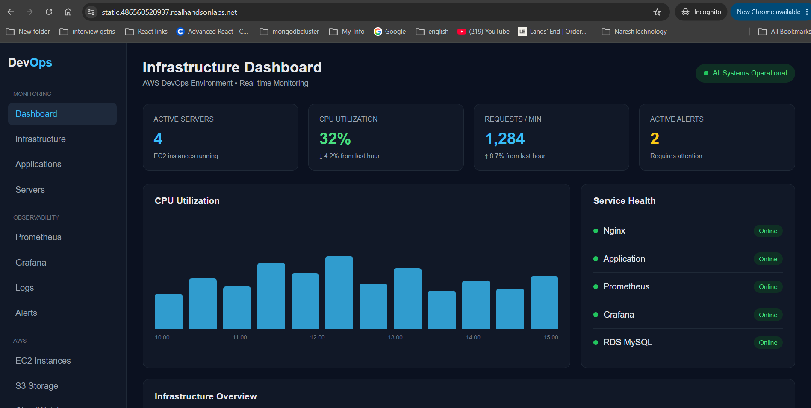

---

# Phase 6 — Automated CloudFront Cache Invalidation

## Step 18 — Configure Lambda IAM Permissions

Created a Lambda execution role with permission to create CloudFront invalidations.

The custom CloudFront policy follows least-privilege principles by restricting `cloudfront:CreateInvalidation` to the required distribution.

The `AWSLambdaBasicExecutionRole` provides permissions for Lambda execution logging to CloudWatch Logs.

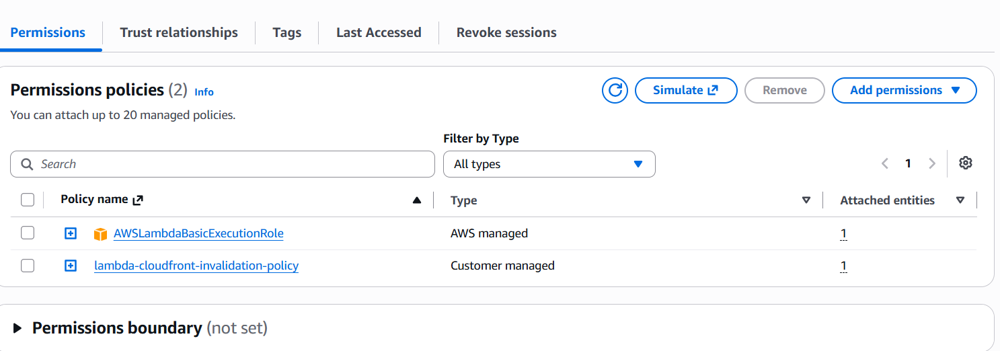

## Step 19 — Create the Lambda Function

Created a Python-based Lambda function responsible for CloudFront cache invalidation.

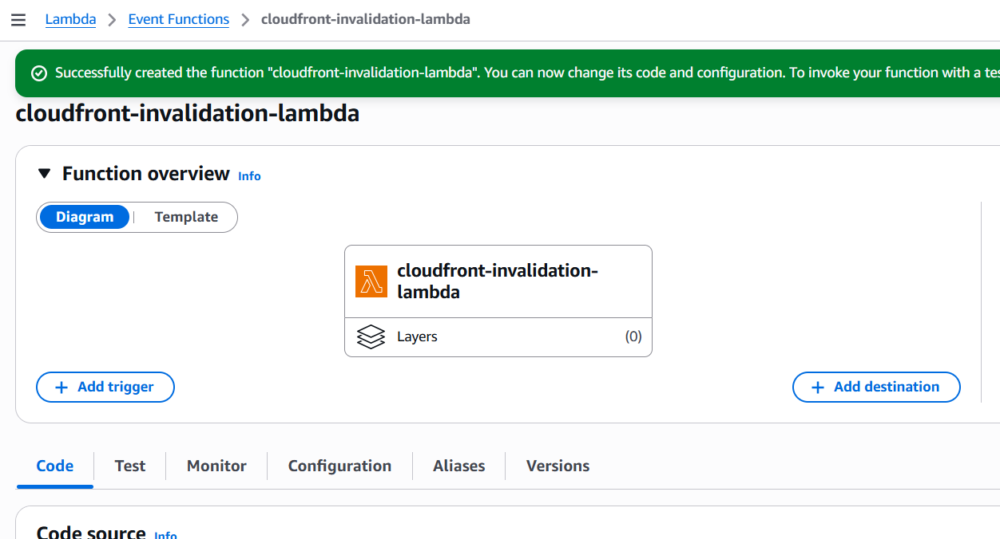

## Step 20 — Implement CloudFront Invalidation

The Lambda function calls the CloudFront `CreateInvalidation` API and invalidates:

`/*`

This ensures updated website objects can be retrieved through CloudFront instead of waiting for cached content to expire.

> The deployed lab function used the CloudFront distribution ID directly. The repository version externalizes the distribution ID through the `CLOUDFRONT_DISTRIBUTION_ID` Lambda environment variable to improve portability across environments.

## Step 21 — Test the Lambda Function

Manually tested the Lambda function and confirmed successful creation of a CloudFront invalidation.

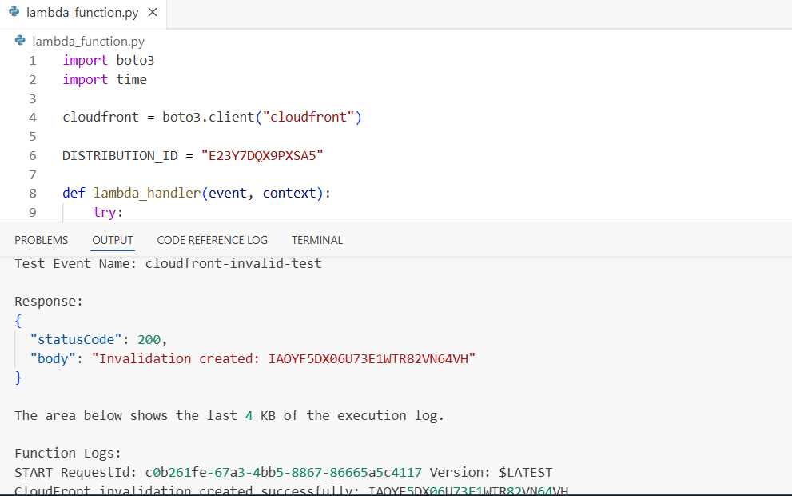

## Step 22 — Verify CloudFront Invalidation

Verified that the CloudFront invalidation completed successfully.

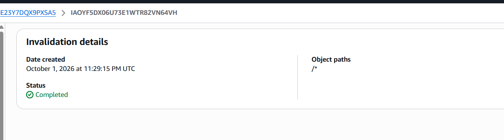

---

# Phase 7 — Event-Driven Automation

## Step 23 — Configure the S3 Lambda Trigger

Configured the S3 bucket to invoke the Lambda function when website objects are created or updated.

Event type:

`s3:ObjectCreated:*`

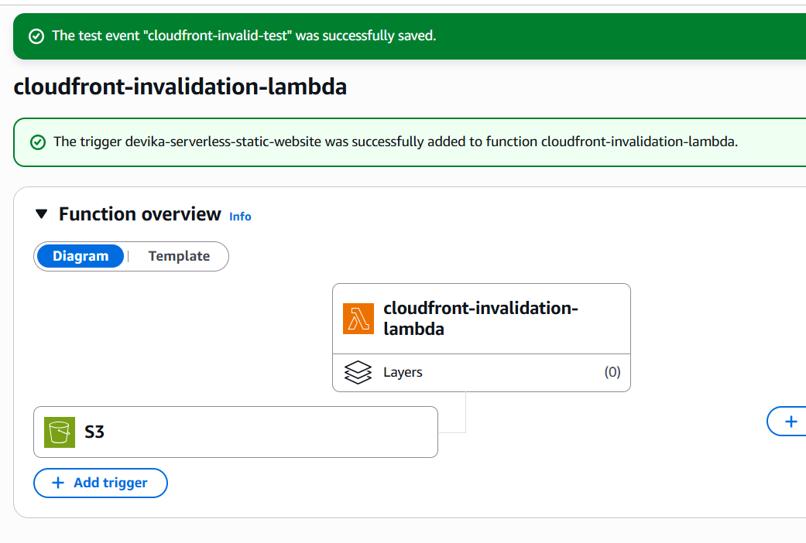

## Step 24 — Verify S3 Event Notification

Verified the S3 Event Notification configuration.

This implementation uses a direct S3 Event Notification to Lambda; EventBridge is not required for this workflow.

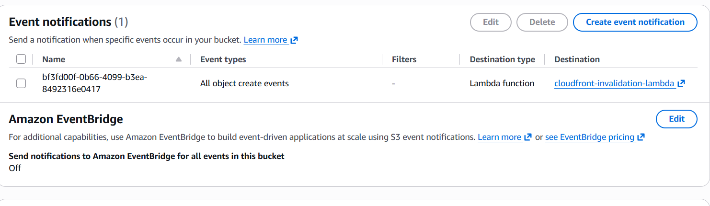

## Step 25 — Test Automatic Invalidation

Updated the website file and uploaded it to S3.

The S3 event automatically invoked Lambda, which created a new CloudFront invalidation.

## Step 26 — Validate Updated Website

Refreshed the HTTPS website and verified that the updated content was delivered successfully after cache invalidation.

---

# Security Controls

The implementation includes:

- Private S3 bucket with Block Public Access
- CloudFront Origin Access Control (OAC)
- HTTPS using AWS Certificate Manager
- Route 53 DNS
- AWS WAF with AWS Managed Rule Groups
- Distribution-specific CloudFront invalidation permission for Lambda
- CloudWatch logging through the Lambda execution role
- Website traffic delivered through CloudFront rather than direct public S3 access

---

# Final Architecture Flow

### User Traffic

User → Route 53 → AWS WAF → CloudFront → OAC → Private S3

### Website Update

Developer → S3 → S3 Event Notification → Lambda → CloudFront Invalidation

### Result

CloudFront retrieves and delivers the updated website content to users over HTTPS.
